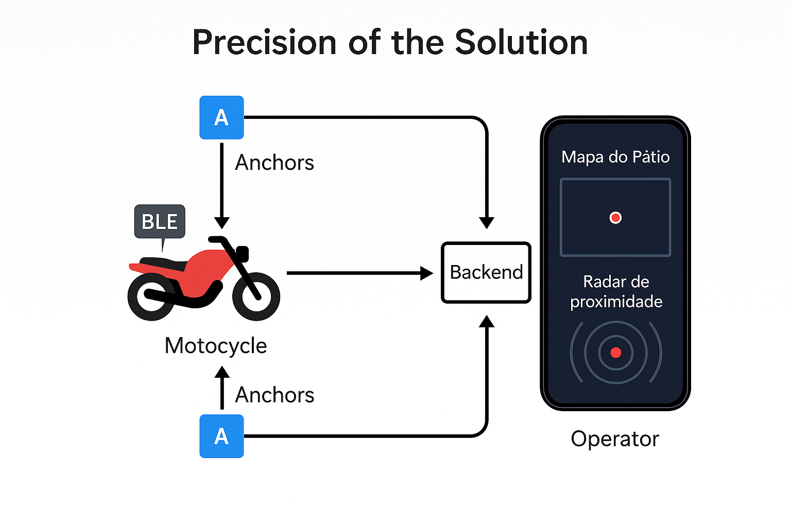

# 🚀 Radar Motu: Sistema de Localização Veicular Indoor de Alta Precisão

### *Sua frota sob controle, seu pátio na palma da mão.*


## 👨‍💻👩‍💻👩‍💻 Equipe de Desenvolvimento**

| Nome                  | RM     | Turma   |                                                                                      
| Paulo André Carminati | 557881 | 2-TDSPZ | 
| Arthur Bispo de Lima  | 557568 | 2-TDSPV | 
| João Paulo Moreira    | 557808 | 2-TDSPV |

---


*Diagrama da arquitetura da solução, demonstrando o fluxo de dados do dispositivo IoT (TAG BLE) até a interface do operador.*

---

## 📋 Tabela de Conteúdos (Será preenchida ao final)

---

## 1. Visão Geral do Projeto

O **Radar Motu** é uma solução completa e robusta de IoT (Internet of Things) desenvolvida para resolver um problema crítico em pátios de veículos: a localização rápida e precisa de motocicletas. O sistema eleva a operação de pátio de um processo manual e demorado para uma solução digital, eficiente e confiável.

Para alcançar este objetivo, desenvolvemos um ecossistema completo que inclui:
* **Hardware de Baixo Custo:** Utilizando microcontroladores ESP32 como âncoras e como dispositivo rastreável (TAG).
* **APIs Especializadas:** Duas APIs criadas por nós:
    1.  Uma **API de Reconhecimento de Placas (OCR)** que digitaliza e identifica os veículos.
    2.  Uma **API de Triangulação** que processa os dados dos sensores para calcular a localização em tempo real.
* **Aplicação Móvel Intuitiva:** Um app que centraliza as operações, permitindo ao operador escanear uma placa, visualizar a localização exata da moto em um mapa digital e usar um radar de proximidade para a localização final.

Este projeto representa uma solução de ponta a ponta, desde a captura de dados no ambiente físico até a sua apresentação inteligente na interface do operador.

## 2. Arquitetura da Solução IoT

O projeto foi construído sobre um ecossistema IoT coeso e de ponta a ponta. A arquitetura foi dividida em camadas, demonstrando o fluxo claro dos dados, desde o ambiente físico até a interface do usuário.

### Camada Física (Hardware - O Pátio Conectado)

* **Dispositivo Móvel (A Moto/TAG):**
    * Para o MVP, utilizamos um **ESP32 DEVKIT V1** como dispositivo rastreável, simulando a TAG que seria acoplada à moto.
    * Ele é programado via **IDE do Arduino** para atuar como um beacon Bluetooth Low Energy (BLE), transmitindo continuamente sua identidade.
    * A alimentação é feita por um **Power Bank**, com o plano de evoluir para uma solução com baterias recarregáveis em uma versão futura.

* **Âncoras (Gateways de Dados):**
    * A infraestrutura do pátio é composta por **4 Âncoras**, cada uma sendo um **ESP32 DEVKIT V1**.
    * Sua função é atuar como *gateways*: elas escaneiam o ambiente, capturam os sinais BLE emitidos pela TAG e medem a intensidade do sinal recebido (**RSSI**).
    * Cada âncora é equipada com um **Buzzer** para testes de comandos remotos e alimentada por um **Power Bank**, garantindo flexibilidade na instalação.

### Camada de Processamento (Backend - O Cérebro da Operação)

* **`radarmotu-api` (FastAPI/Python):** O backend é onde a inteligência da solução reside. Ele é responsável por:
    1.  **Ingestão de Dados:** Receber os valores de RSSI enviados pelas 4 âncoras via Wi-Fi.
    2.  **Cálculo de Triangulação:** Utilizar nossa **API de triangulação customizada** para processar os múltiplos valores de RSSI. O algoritmo calcula a posição (coordenadas X, Y) do dispositivo móvel no pátio com alta precisão.
    3.  **Lógica de Negócio:** Gerenciar a **API de reconhecimento de placas (OCR)**, associar veículos a TAGs e persistir todos os dados no banco de dados (`radarmotu.db`).

> **Ponto-chave:** O cálculo complexo de triangulação é centralizado no backend. Isso torna o hardware de ponta (âncoras) mais simples e de baixo custo, enquanto aproveita o poder de processamento do servidor.

### Camada de Apresentação (Frontend - A Interface do Operador)

* **`radarmotu-app` (React Native):** O aplicativo móvel é a interface homem-máquina (IHM) da nossa solução.
    * Ele **consome os dados já processados** pelo backend. Ao invés de receber dados brutos de RSSI, ele solicita à API a posição final da moto.
    * Sua principal função é **visualizar os dados**: exibir a localização no "Mapa do Pátio" e a proximidade no "Radar", garantindo uma experiência de usuário fluida e intuitiva.

## 3. Atendendo aos Critérios da 3ª Sprint

O projeto foi meticulosamente planejado e executado para satisfazer e exceder todos os critérios de avaliação propostos para esta Sprint.

### ✅ Comunicação entre Sensores/Visão e Backend | `(até 30 pts)`

A comunicação é o coração da nossa solução IoT e foi implementada com sucesso, garantindo um fluxo de dados robusto e em tempo real.

1.  **Comunicação Sensores ➔ Backend (IoT):**
    * As 4 âncoras ESP32 capturam os dados brutos de RSSI da TAG móvel.
    * Esses dados são enviados via Wi-Fi (HTTP) para endpoints específicos da nossa **`radarmotu-api`**. O payload enviado é estruturado, contendo `ID_DA_ANCORA`, `ID_DA_TAG` e `VALOR_RSSI`.
    * Este fluxo de "telemetria" é a base para o sistema de localização.

2.  **Comunicação Visão ➔ Backend (OCR):**
    * O aplicativo utiliza nossa **API de reconhecimento de placas customizada**.
    * A placa, uma vez digitalizada e convertida para string, é enviada para um endpoint no backend (ex: `/vehicles/find-by-plate`).
    * O backend valida a placa no banco de dados e retorna a TAG associada, integrando o mundo físico (placa) ao nosso ecossistema digital (TAG).

### ✅ Dashboard/Output Visual com Dados em Tempo Real | `(até 30 pts)`

O `radarmotu-app` funciona como um dashboard operacional completo, fornecendo ao usuário final um output visual claro e dinâmico dos dados processados pelo backend.

* **Dashboard Principal (Mapa do Pátio):** Esta tela exibe a posição calculada da moto (ponto verde) sobre uma planta do pátio. A interface consome os dados de coordenadas (X, Y) da API e atualiza a posição em tempo real, oferecendo uma visão macro da localização do ativo.
* **Output de Alta Precisão (Radar de Proximidade):** Para a busca final, o radar exibe a **Distância** e o **RSSI** em tempo real. Esses valores mudam dinamicamente conforme o operador se aproxima do veículo, servindo como um output visual e numérico preciso para a localização final.

| Mapa do Pátio (Dashboard) | Radar de Proximidade (Output Real-Time) |
| :---: | :---: |
|  |  |


### ✅ Persistência e Estruturação dos Dados | `(até 20 pts)`

Garantimos a integridade e a organização dos dados através de uma arquitetura de backend bem definida.

* **Persistência:** Utilizamos um banco de dados **SQLite** (`radarmotu.db`), que é leve, serverless e ideal para o escopo do nosso MVP. Ele armazena todas as informações essenciais da aplicação.
* **Estrutura:** Seguimos as melhores práticas do FastAPI, utilizando:
    * **`models.py`:** Define a estrutura das tabelas do banco de dados (via SQLAlchemy ORM).
    * **`schemas.py`:** Define os schemas de dados para validação na API (via Pydantic), garantindo que apenas dados válidos e bem-formados sejam aceitos e retornados.
    * **`anchors.json`:** Um arquivo de configuração para persistir as posições fixas das âncoras no pátio.

### ✅ Organização do Código e Documentação Técnica | `(até 20 pts)`

A base de código do projeto foi organizada com um claro princípio de **separação de responsabilidades**, facilitando a manutenção e a escalabilidade.

* **Backend (`radarmotu-api`):**
    * `main.py`: Ponto de entrada da aplicação.
    * `routers/`: Define os endpoints da API (ex: `/vehicles`, `/location`), separando a lógica de roteamento.
    * `services/` e `estimator.py`: Contêm a lógica de negócio principal, incluindo o algoritmo de triangulação.
    * `database.py`: Gerencia a conexão e a sessão com o banco de dados.

* **Frontend (`radarmotu-app`):**
    * `screens/`: Cada arquivo (`.tsx`) representa uma tela do aplicativo (ex: `MapaScreen`, `RadarProximidadeScreen`).
    * `components/`: Armazena componentes reutilizáveis da interface (ex: `VehicleCard`).
    * `services/`: Centraliza a lógica de comunicação com a nossa API.

* **Documentação:** Este arquivo `README.md` serve como a documentação técnica central do projeto.

## 4. Demonstração em Vídeo

Para uma visão completa da solução em funcionamento, desde o escaneamento da placa até a localização em tempo real com o radar, assista à nossa apresentação e demonstração no YouTube.

> ### 🎥 **[ASSISTIR AO VÍDEO DE DEMONSTRAÇÃO NO YOUTUBE]**
> *https://www.youtube.com/watch?v=MCH5RcNdic0*

---

## 5. Tecnologias Utilizadas

Este projeto foi construído com uma combinação de tecnologias modernas e eficientes, escolhidas para garantir desempenho, escalabilidade e uma ótima experiência de desenvolvimento.

| Categoria | Tecnologias |
| :--- | :--- |
| **Backend** |    |
| **Frontend (Mobile)** |    |
| **Hardware (IoT)** |    |
| **Ferramentas & DevOps** |    |

## 6. Estrutura do Projeto

O código-fonte foi organizado em um formato de monorepo, separando de forma clara e lógica as três principais frentes do projeto: `hardware`, `radarmotu-api` (backend) e `radarmotu-app` (frontend). Essa abordagem facilita o desenvolvimento, a manutenção e a escalabilidade da solução.

## 6. Estrutura do Projeto

O código-fonte foi organizado em um formato de monorepo, separando de forma clara e lógica as três principais frentes do projeto: `hardware`, `radarmotu-api` (backend) e `radarmotu-app` (frontend). Essa abordagem facilita o desenvolvimento, a manutenção e a escalabilidade da solução.

### 📁 `radarmotu-api` (Backend)

A API segue uma arquitetura robusta e modular, inspirada nas melhores práticas de desenvolvimento com FastAPI.

```t
radarmotu-api/
└── app/
    ├── routers/        # Define os endpoints da API (as "rotas")
    ├── services/       # Contém a lógica de negócio principal
    ├── .env.example    # Exemplo de variáveis de ambiente
    ├── anchors.json    # Configuração das posições das âncoras
    ├── database.py     # Gerencia a conexão com o banco de dados
    ├── estimator.py    # Módulo com o algoritmo de triangulação/localização
    ├── main.py         # Ponto de entrada principal da aplicação FastAPI
    ├── models.py       # Define as tabelas do banco de dados (SQLAlchemy)
    ├── schemas.py      # Define os schemas de dados para validação (Pydantic)
    ├── security.py     # Lógica de autenticação e segurança
    └── radarmotu.db    # Arquivo do banco de dados SQLite
```

main.py: Inicializa a aplicação e inclui os roteadores.

routers/: Cada arquivo aqui define um grupo de endpoints (ex: /vehicles, /tags), mantendo o código de roteamento organizado.

services/ e estimator.py: O coração da API. services orquestra as regras de negócio, enquanto estimator.py contém a lógica matemática para calcular a posição do veículo com base no RSSI.

models.py e schemas.py: Trabalham juntos para garantir que os dados que entram e saem da API e do banco de dados sejam sempre bem estruturados e validados.

📁 radarmotu-app (Frontend)
O aplicativo móvel foi estruturado de forma a separar a lógica da interface, facilitando a reutilização de componentes e a manutenção das telas.

```t
radarmotu-app/
├── assets/             # Imagens, fontes e outros arquivos estáticos
├── components/         # Componentes de UI reutilizáveis (ex: botões, cards)
│   └── VehicleCard.tsx
├── config/             # Arquivos de configuração
│   └── env.ts
├── screens/            # Cada arquivo é uma tela do aplicativo
│   ├── HomeScreen.tsx
│   ├── MapaScreen.tsx
│   └── RadarProximidadeScreen.tsx
├── services/           # Lógica de comunicação com a API backend
├── App.tsx             # Componente raiz do aplicativo
└── package.json        # Dependências e scripts do projeto
```

screens/: Contém a estrutura principal de cada tela visível para o usuário. A lógica de cada tela é encapsulada aqui.

components/: Peças fundamentais da nossa interface. Ao criar componentes como VehicleCard.tsx, evitamos a repetição de código e mantemos um design consistente.

services/: Esta pasta abstrai toda a complexidade da comunicação HTTP. As telas chamam funções simples daqui (ex: getVehicleLocation(plate)) sem precisar saber os detalhes da API.

config/: Centraliza configurações importantes, como o endereço da nossa API, facilitando a troca entre ambientes de desenvolvimento e produção.

## 7. Como Rodar o Projeto do Zero

Siga os passos abaixo para configurar e executar o ambiente de desenvolvimento completo em sua máquina local.

### Pré-requisitos
* **Node.js (LTS)** e **npm**
* **Python 3.9+** e **pip**
* **Git**
* **Android Studio** com um Emulador Android configurado (ou um dispositivo físico)
* **Expo Go App** instalado no seu dispositivo físico (caso opte por não usar o emulador)

---
### Passo 1: Clonar o Repositório
```bash
git clone [URL_DO_SEU_REPOSITORIO]
cd [NOME_DA_PASTA_DO_PROJETO]

### Passo 2: Configurar e Rodar o Backend (API)

# Navegue até a pasta da API
cd radarmotu-api

# Crie e ative um ambiente virtual
python -m venv venv
# No Windows:
.\venv\Scripts\activate
# No Linux/Mac:
# source venv/bin/activate

# Instale as dependências do Python
pip install -r requirements.txt

# Inicie o servidor de desenvolvimento
uvicorn app.main:app --reload --host 0.0.0.0 --port 8000

✅ Pronto! A API estará rodando e acessível na sua rede local. Anote o seu endereço de IP (ex: 192.168.1.10), você precisará dele no App.

### Passo 3: Configurar e Rodar o Frontend (App)

# Em um novo terminal, navegue até a pasta do App
cd radarmotu-app

# Instale as dependências do Node.js
npm install

# (Opcional) Se encontrar erros de dependência, use:
npm install --legacy-peer-deps

# Inicie o servidor do Expo
npx expo start

❗ Importante: Após iniciar o Expo, abra o arquivo radarmotu-app/config/env.ts (ou similar) e atualize o endereço da API para o IP da máquina onde o backend está rodando (ex: http://192.168.1.10:8000).


Após configurar o IP, você pode:

Escanear o QR Code com o app Expo Go no seu celular.

Ou, para rodar diretamente no emulador/dispositivo USB:

npx expo run:android
